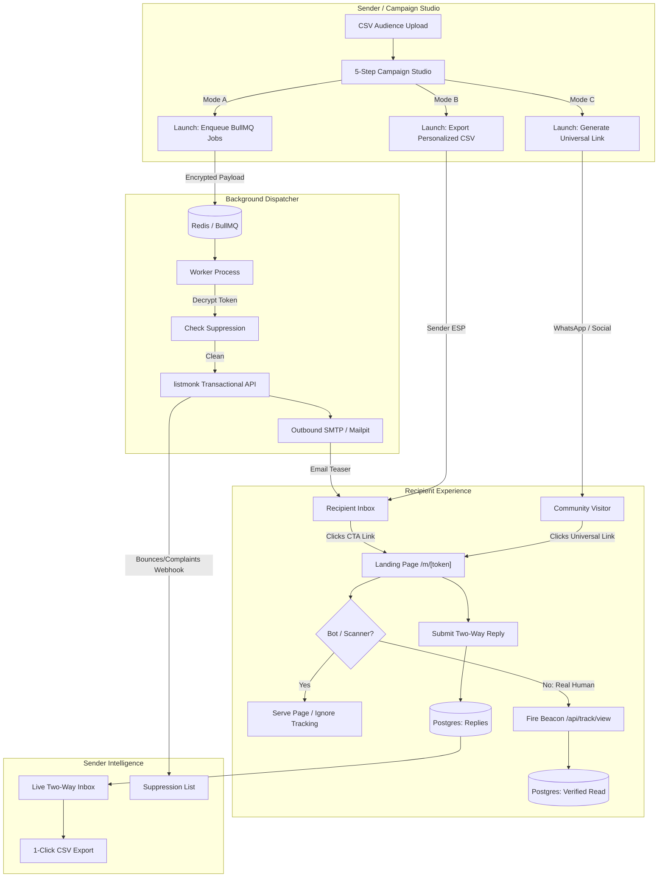
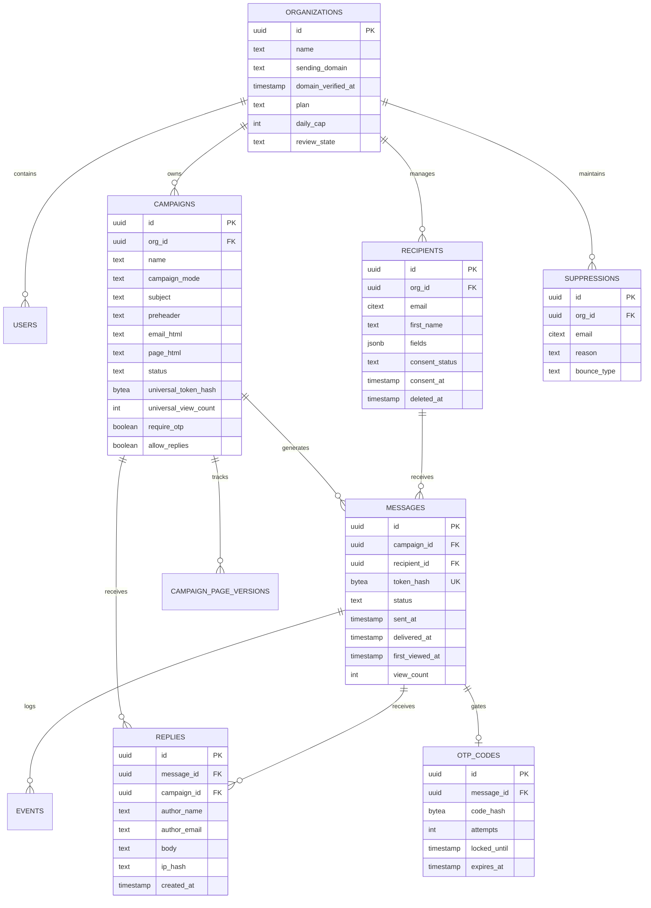

# Campaign Messaging Platform

A high-deliverability confidential email teaser, dynamic personalized landing page, and two-way recipient communication engine.

---

## 📖 Table of Contents

- [1. Executive Summary & Problem Solved](#1-executive-summary--problem-solved)
- [2. The Three Send Modes](#2-the-three-send-modes)
  - [Mode A — "We Send It" (Managed Send)](#mode-a--we-send-it-managed-send)
  - [Mode B — "You Send It" (Personal Links CSV Export)](#mode-b--you-send-it-personal-links-csv-export)
  - [Mode C — "Share Anywhere" (Universal Broadcast Link)](#mode-c--share-anywhere-universal-broadcast-link)
  - [Mode Feature Comparison](#mode-feature-comparison)
- [3. Architecture & Monorepo Structure](#3-architecture--monorepo-structure)
  - [High-Level System Flow](#high-level-system-flow)
  - [Monorepo Layout](#monorepo-layout)
  - [Technology Stack](#technology-stack)
- [4. Security & Cryptographic Invariants](#4-security--cryptographic-invariants)
- [5. Design System & Anti-Slop Guidelines](#5-design-system--anti-slop-guidelines)
- [6. Campaign Studio (5-Step Stepper)](#6-campaign-studio-5-step-stepper)
- [7. Database Schema & Data Models](#7-database-schema--data-models)
- [8. API Reference](#8-api-reference)
- [9. Getting Started & Local Development](#9-getting-started--local-development)
  - [Prerequisites](#prerequisites)
  - [Quickstart Guide](#quickstart-guide)
  - [Service Endpoints](#service-endpoints)
  - [Instant Dev Login](#instant-dev-login)
- [10. Testing & Tooling](#10-testing--tooling)
- [11. Operations, Runbook & Key Procedures](#11-operations-runbook--key-procedures)
- [12. Deploying to Render via Render CLI & Blueprint](#12-deploying-to-render-via-render-cli--blueprint)

---

## 1. Executive Summary & Problem Solved

Modern outbound communication suffers from a critical dilemma:

1. **Inbox Deliverability Cliff:** High-value messages containing legal notices, financial/crypto updates, executive briefings, or sensitive invitations frequently trigger email spam filters due to triggering phrases, attachments, or heavy styling.
2. **Cold Inbox Fatigue:** Recipients ignore walls of static text or unverified mass marketing emails.
3. **Inaccurate Tracking:** Email security appliances (e.g. Mimecast, Proofpoint, Barracuda, Google Image Proxy) automatically click links and pre-fetch images, corrupting open and click metrics with massive false-positive reads.

### The Solution: Decoupled Payload Delivery

The **Campaign Messaging Platform** solves this by cleanly decoupling the **inbox notification teaser** from the **personalized content payload**:

- **Minimalist Intro Email:** An inbox notification containing only a personalized greeting (`{{first_name}}`, `{{sex}}`), a curiosity-piquing teaser, and a secure CTA button. Because the email contains zero trigger phrases, inbox placement remains pristine.
- **Private Interactive Landing Page (`/m/[token]`):** The recipient opens a secure, token-authenticated web briefing personalized with their attributes, complete with verified read tracking, optional OTP gating, and interactive action buttons.
- **Two-Way Reply Box:** Recipients can respond directly from their landing page. Senders manage responses in a real-time inbox with 1-click RFC-4180 CSV export.
- **Bot/Scanner Defense:** Email security crawlers are served the page but rejected from tracking through User-Agent screening, timing heuristics, and an asynchronous JavaScript beacon.

---

## 2. The Three Send Modes

Senders choose one of three operating modes per campaign:

```
┌────────────────────────────────────────────────────────────────────────┐
│                        CAMPAIGN MESSAGING MODES                        │
├───────────────────────┬────────────────────────┬───────────────────────┤
│ Mode A: We Send It    │ Mode B: You Send It    │ Mode C: Share Anywhere│
│ (Managed Transaction) │ (Personal CSV Links)   │ (Universal Broadcast) │
├───────────────────────┼────────────────────────┼───────────────────────┤
│ • Platform sends mail │ • Platform creates CSV │ • 1 shared public link│
│ • listmonk + BullMQ   │ • Send via your ESP    │ • WhatsApp / Telegram │
│ • Full deliverability │ • Private landing page │ • Aggregate analytics │
│ • Auto-suppression    │ • Verified reads       │ • Anonymous/ID replies│
└───────────────────────┴────────────────────────┴───────────────────────┘
```

### Mode A — "We Send It" (`managed_send`)

_Platform handles end-to-end delivery via transactional queues._

- **Workflow:**
  1. Upload recipient CSV (`email,first_name,sex,...`).
  2. Compose email template (teaser) and landing page template with variable tokens.
  3. Launch campaign: The platform generates a unique cryptographic token per recipient, enqueues BullMQ jobs, and dispatches transactional emails via **listmonk**.
  4. listmonk webhook updates message statuses (`sent`, `delivered`, `hard_bounce`, `complaint`, `unsubscribe`).
  5. Hard bounces and complaints automatically feed the organization's suppression list.
  6. Recipient clicks their link to access their private `/m/[token]` page.

### Mode B — "You Send It" (`link_per_recipient`)

_Use your own mailer (Mailchimp, HubSpot, Gmail, cold outbound tools) while retaining personalized web pages._

- **Workflow:**
  1. Upload recipient list into the studio.
  2. Author the personalized landing page template.
  3. Launch campaign: Platform creates individual tokens and compiles an exportable CSV with columns `email,first_name,sex,landing_link`.
  4. Sender downloads the CSV and merges links into their existing CRM or outbound software.
  5. Recipients receive emails from the sender's own infrastructure, click their link, and view a fully personalized landing page with verified read tracking and two-way replies.

### Mode C — "Share Anywhere" (`link_universal`)

_A single, high-converting broadcast link for group chats, social channels, or QR codes._

- **Workflow:**
  1. No recipient list or CSV upload required.
  2. Author the public briefing page template.
  3. Launch campaign: Platform generates a single universal campaign token (`/m/[sharedToken]`).
  4. Sender copies the link and shares it directly to WhatsApp groups, Slack communities, Discord, SMS blasts, or printed collateral.
  5. Visitors view the same responsive briefing page. If replies are enabled, visitors can optionally submit their name, email, and response.

### Mode Feature Comparison

| Capability                           | Mode A: We Send It | Mode B: You Send It |   Mode C: Share Anywhere    |
| :----------------------------------- | :----------------: | :-----------------: | :-------------------------: |
| **Email dispatched by platform**     |         ✅         |  ❌ (Sender's ESP)  |        ❌ (No email)        |
| **Personalized email teaser**        |         ✅         |         ❌          |             ❌              |
| **Personalized landing page**        |         ✅         |         ✅          |    ❌ (Uniform content)     |
| **Audience CSV required**            |         ✅         |         ✅          |             ❌              |
| **Bounce & complaint tracking**      |   ✅ (Automatic)   |         ❌          |             ❌              |
| **Auto-suppression on bounce**       |         ✅         | ❌ (Manual import)  |             ❌              |
| **Verified per-person read receipt** |         ✅         |         ✅          |   ❌ (Aggregate counter)    |
| **OTP / PIN gate protection**        |         ✅         |         ✅          |             ✅              |
| **Two-way reply collection**         |         ✅         |         ✅          | ✅ (Includes author fields) |
| **Channel agnostic (WhatsApp, QR)**  | ❌ (Per-recipient) | ❌ (Per-recipient)  |     ✅ (Universal link)     |
| **Requires verified sending domain** |         ✅         |         ❌          |             ❌              |

---

## 3. Architecture & Monorepo Structure

The platform is organized as a production-grade monorepo managed with **pnpm workspaces**:

```
.
├── apps/
│   ├── web/            # Next.js 15 App Router (Studio, Public Landing Pages, API)
│   └── worker/         # BullMQ + Redis Background Dispatch Worker
├── packages/
│   ├── core/           # Pure TypeScript domain logic (crypto, render, CSV, tracking, etc.)
│   └── db/             # Drizzle ORM schema, PgBouncer pooler, and migrations
├── docs/               # Architecture decisions (DECISIONS.md) & operational runbooks (RUNBOOK.md)
├── docker/             # Postgres init scripts & infrastructure configuration
├── scripts/            # Database runners, seeding, and sample email generation
├── docker-compose.yml  # Full local development container stack
├── package.json        # Root scripts and workspace devDependencies
├── pnpm-workspace.yaml # Monorepo workspace configuration
├── AGENT_PLAN.md       # Complete milestone specification and architectural contract
└── DESIGN.md           # Visual design system & Anti-Slop interface guidelines
```

### High-Level System Flow



### Package & App Breakdown

- **`apps/web` (Next.js 15)**
  - **Campaign Studio (`CampaignStudio.tsx`):** Comprehensive 5-step interactive wizard with real-time reactive previews.
  - **Public Landing Route (`/m/[token]`):** Zero-friction page resolution with timing heuristics, sliding-window rate limiting, and OTP gating.
  - **API Engine (`/api/*`):** REST endpoints for campaigns, audiences, domain verification, replies, webhooks, health, and metrics.
  - **Auth (`auth.ts`, `auth-adapter.ts`):** Auth.js v5 with passwordless magic links, rotating database sessions, and instantaneous dev bypass.
- **`apps/worker` (BullMQ Worker)**
  - Ingests dispatch jobs for Mode A campaigns.
  - Reads AES-256-GCM encrypted tokens, checks real-time suppression, and executes idempotent transactional sends via listmonk.
  - Retries transient failures with exponential backoff; handles dead-letter marking after 5 attempts.
  - Runs automatic 15-minute background sweeps to purge expired OTP codes.
- **`packages/core` (Business Logic)**
  - `tokens`: Cryptographic random token generation (`newToken()`), SHA-256 hashing, AES-256-GCM encryption/decryption.
  - `render`: Fast template variable engine supporting `{{field}}` and fallback syntax `{{field|default}}`.
  - `tracking`: Verified read detection, anti-scanner heuristics (`bots.ts`), and timing evaluation.
  - `csv`: RFC-4180 streaming CSV parser and serializer.
  - `otp`: 6-digit cryptographic PIN generation, attempt limit enforcement, and lockout timers.
  - `suppression`: Per-organization suppression list enforcement and bounce classification.
  - `sanitise`: Strict HTML sanitization preventing XSS in user-submitted templates.
  - `screening`: Prohibited phrase and email screening.
  - `listmonk`: Typed HTTP client for listmonk subscriber management and transactional email dispatch.
- **`packages/db` (Data Layer)**
  - Drizzle ORM schema mapping organizations, users, campaigns, messages, events, replies, suppressions, and OTP codes.
  - Custom PostgreSQL types (`citext` for case-insensitive emails, `bytea` for binary cryptographic hashes).
  - PgBouncer-compatible connection pooler.

### Technology Stack

| Layer               | Technology                              | Purpose                                                           |
| :------------------ | :-------------------------------------- | :---------------------------------------------------------------- |
| **Framework**       | Next.js 15 (App Router, React 19)       | Web Studio, API routes, and public dynamic page delivery          |
| **Language**        | TypeScript 5.8                          | End-to-end type safety across apps and workspace packages         |
| **Database**        | PostgreSQL 16 (or Embedded Postgres 18) | Multi-tenant persistent relational store                          |
| **ORM**             | Drizzle ORM                             | High-performance, schema-as-code type-safe database queries       |
| **Connection Pool** | PgBouncer (Transaction mode)            | High-throughput connection pooling on port 5433                   |
| **Queues / Cache**  | Redis 7 + BullMQ                        | Reliable job queueing, rate limiting, and view deduplication      |
| **Email Engine**    | listmonk                                | Transactional SMTP engine, throughput throttling, bounce webhooks |
| **Local SMTP Trap** | Mailpit                                 | Local development SMTP server (1025) and visual web inbox (8025)  |
| **Authentication**  | Auth.js v5 (NextAuth)                   | Passwordless magic link auth with custom Drizzle adapter          |
| **Testing**         | Vitest 3.2                              | Fast parallel unit and integration test runner                    |

---

## 4. Security & Cryptographic Invariants

The platform enforces strict security guarantees across all layers:

1. **Zero Raw Token Persistence**
   - Private landing tokens are 128-bit cryptographically secure random values (URL-safe base64).
   - **The database never stores raw tokens.** Only the one-way SHA-256 hash (`bytea`) is persisted. Even if the database is compromised, landing page access cannot be forged.
2. **Encrypted Queue Payloads**
   - When raw tokens are enqueued into BullMQ / Redis for Mode A dispatch, their payloads are encrypted with **AES-256-GCM** using `TOKEN_ENCRYPTION_KEY`.
   - Redis compromise does not reveal raw landing links.
3. **Bot & Scanner Neutralization (Zero False Positives)**
   - Corporate email gateways (e.g. Proofpoint, Mimecast, Defender) crawl links inside incoming emails before delivering them to users.
   - The platform screens requests using known scanner user-agent signatures and delivery-to-click timing heuristics.
   - **Result:** Scanners receive the page content, but no view event is logged to the database. A verified read is only registered when an interactive JavaScript beacon (`/api/track/view`) fires from a real human browser session.
4. **Sliding-Window IP Rate Limiting & Penalty Box**
   - Public landing pages (`/m/[token]`) enforce a sliding window of **30 requests / 10 minutes** per IP hash via Redis sorted sets.
   - Probing with invalid tokens triggers a miss counter: **10 invalid attempts** places the IP into a **30-minute blocklist**.
5. **Hardened HTTP Response Headers**
   - Landing routes and unsubscribe endpoints enforce:
     ```http
     Cache-Control: no-store, no-cache, must-revalidate
     Referrer-Policy: no-referrer
     X-Robots-Tag: noindex, nofollow
     Content-Security-Policy: default-src 'self'; script-src 'self' 'unsafe-inline'; style-src 'self' 'unsafe-inline'; img-src 'self' data: https:; frame-ancestors 'none'
     ```
6. **Per-Organization Suppression Isolation**
   - Multi-tenant boundary: An unsubscribe or bounce in Org A suppresses further sends within Org A, but does not impact separate sending activity in Org B.
7. **GDPR-Compliant Soft Deletion**
   - Deleting a recipient soft-deletes the record and nullifies personal identifiable information (PII) while preserving message event logs for audit and complaint compliance.

---

## 5. Design System & Anti-Slop Guidelines

The user interface follows strict guidelines defined in `DESIGN.md` to guarantee tactical clarity, professional aesthetics, and zero visual fatigue.

### Core Visual Principles

- **Warm Slate Foundation:** Avoids pitch-black obsidian eye fatigue and generic pure white glare by using a `#f8fafc` (Slate-50) canvas paired with elevated white card surfaces (`#ffffff`).
- **Hairline Tactile Boundaries:** Subtle `1px solid #e2e8f0` dividers and borders instead of blurred drop shadows.
- **Curated Semantic Accents:**
  - Primary Brand: Indigo (`#4f46e5`, hover `#4338ca`)
  - Success / Verified: Emerald (`#ecfdf5` background, `#065f46` text, `#10b981` dot)
  - Warning / Unverified: Amber (`#fffbeb` background, `#92400e` text)
  - Destructive / Error: Rose (`#fef2f2` background, `#991b1b` text)

### Anti-Slop Prohibitions

| Prohibited Anti-Pattern                             | Reason for Prohibition             | Approved Standard                                    |
| :-------------------------------------------------- | :--------------------------------- | :--------------------------------------------------- |
| **Glowing Outer Box Shadows** (`0 0 25px #6366f1`)  | Low clarity, looks like an AI demo | Crisp hairline borders: `1px solid #e2e8f0`          |
| **Gradient Text Clipping** (`bg-clip: text`)        | Inaccessible, low contrast         | Solid high-contrast text: `#0f172a` (Titles)         |
| **Neon Halo Dots** (`box-shadow: 0 0 10px #10b981`) | Visual noise and clutter           | Crisp 8px emerald dot with solid fill                |
| **Pitch-Black Cards** (`#0a0f1d`)                   | Heavy visual fatigue               | Slate-50 canvas with elevated white cards            |
| **Buzzword Marketing Copy**                         | Confuses users                     | Concrete action labels ("Import Audience", "Launch") |

---

## 6. Campaign Studio (5-Step Stepper)

The main studio interface (`apps/web/src/app/CampaignStudio.tsx`) guides senders through an interactive, fail-safe 5-step campaign lifecycle:

```
[1. Audience & Mode] ──> [2. Compose & Variables] ──> [3. Live Preview] ──> [4. Export & Send] ──> [5. Two-Way Inbox]
```

1. **Step 1: Audience & Mode**
   - Switch between **Personalized Mode** (per-recipient link) and **WhatsApp / Broadcast Mode** (single shared link).
   - Drag-and-drop CSV upload or paste raw text. Parses `email`, `first_name`, `sex`, and custom attributes with instant row validation.
2. **Step 2: Compose & Variables**
   - **Subject Line Counter & Truncation Guard:** Alerts the sender in real-time if their subject exceeds the 60-character mobile inbox threshold.
   - **Variable Injection Pills:** 1-click token injection for `{{first_name}}`, `{{sex}}`, or fallback syntax `{{sex|friend}}` into Subject, Intro Teaser, or Landing Content.
   - **Security Controls:** Toggle OTP PIN protection and enable/disable two-way recipient replies.
3. **Step 3: Live Preview**
   - Toggle between **Email Notification View** and **Landing Page View**.
   - **Dual-Viewport Hardware Simulator:** Live switch between full **Desktop** browser chrome and an authentic **375px Smartphone simulator** complete with bezel and speaker notch.
   - Recipient pagination selector to preview personalization against actual contact data.
4. **Step 4: Export & Send (Fulfillment)**
   - **Mode A Dispatch:** 1-click launch enqueues messages to BullMQ with progress metrics.
   - **Mode B CSV Export:** Download clean CSV (`email,first_name,sex,landing_link`) formatted for any CRM or external sender.
   - **Mode C Broadcast Link:** 1-click link copy and instant WhatsApp share URL generator.
   - **DNS Verification Banner:** Live SPF, DKIM, and DMARC verification modal with copyable DNS records.
5. **Step 5: Two-Way Inbox & Replies**
   - Real-time unified inbox displaying responses from individual email recipients and public broadcast visitors.
   - Highlights sender name, email, message body, relative timestamp, and delivery channel.
   - **1-Click CSV Export:** Export complete reply threads to RFC-4180 compliant CSV.

---

## 7. Database Schema & Data Models

Managed via **Drizzle ORM** in `packages/db/src/schema/index.ts`. All IDs use cryptographically generated UUIDs (`gen_random_uuid()`).



---

## 8. API Reference

All requests and responses use JSON (`application/json`) unless otherwise noted. Authenticated endpoints require an active session cookie or Bearer token.

### Authentication & Fast Onboarding

| Method | Endpoint              | Description                                                                     |
| :----- | :-------------------- | :------------------------------------------------------------------------------ |
| `GET`  | `/api/auth/signin`    | Auth.js sign-in page (Magic Link provider)                                      |
| `GET`  | `/api/auth/dev-login` | **Instant Development Bypass:** Provisions seeded admin and establishes session |

### Campaigns Management

| Method | Endpoint                           | Description                                                                          |
| :----- | :--------------------------------- | :----------------------------------------------------------------------------------- |
| `GET`  | `/api/campaigns`                   | List campaigns for the active organization                                           |
| `POST` | `/api/campaigns`                   | Create a new campaign draft (`managed_send`, `link_per_recipient`, `link_universal`) |
| `POST` | `/api/campaigns/quick-create`      | Quick campaign builder with automatic recipient mapping                              |
| `GET`  | `/api/campaigns/[id]`              | Get campaign configuration and page HTML                                             |
| `POST` | `/api/campaigns/[id]/preview`      | Render preview with variable substitution for a sample contact                       |
| `POST` | `/api/campaigns/[id]/launch`       | Launch campaign: enqueues Mode A worker jobs or generates Mode B/C tokens            |
| `GET`  | `/api/campaigns/[id]/export-links` | Download Mode B personalized links as CSV (`email,first_name,sex,landing_link`)      |
| `GET`  | `/api/campaigns/[id]/results`      | Get delivery, bounce, complaint, open, and read metrics                              |

### Audience & Domain Verification

| Method | Endpoint                 | Description                                                              |
| :----- | :----------------------- | :----------------------------------------------------------------------- |
| `POST` | `/api/recipients/import` | Upload CSV recipient list with explicit consent declaration              |
| `POST` | `/api/org/verify-domain` | Query live DNS records (SPF & DMARC) for the organization sending domain |
| `GET`  | `/api/suppressions`      | List suppressed email addresses for the organization                     |
| `POST` | `/api/suppressions`      | Manually add an email to the suppression list                            |

### Public Endpoints & Recipient Actions

| Method     | Endpoint                    | Description                                                               |
| :--------- | :-------------------------- | :------------------------------------------------------------------------ |
| `GET`      | `/m/[token]`                | Render the secure personalized landing page (or universal broadcast page) |
| `POST`     | `/api/track/view`           | Asynchronous beacon recording a verified human page read                  |
| `POST`     | `/api/messages/[id]/action` | Register CTA button click, RSVP, or user confirmation                     |
| `POST`     | `/api/messages/[id]/reply`  | Submit a recipient reply from a personalized landing page                 |
| `POST`     | `/api/replies`              | Submit a reply from a public broadcast page / fetch campaign replies      |
| `POST`     | `/api/otp/request`          | Request a 6-digit OTP code to access gated landing pages                  |
| `POST`     | `/api/otp/verify`           | Verify submitted OTP code and grant access token                          |
| `GET/POST` | `/unsubscribe`              | One-click recipient unsubscribe handler                                   |

### Team Management & Invitations Endpoints

| Method   | Endpoint                        | Description                                                                    |
| :------- | :------------------------------ | :----------------------------------------------------------------------------- |
| `GET`    | `/api/team/members`             | List all members in the organization with roles and capability flags           |
| `PATCH`  | `/api/team/members/[id]`        | Update member role or granular capabilities (`can_launch`, `can_export`, etc.) |
| `DELETE` | `/api/team/members/[id]`        | Remove member from organization (with owner protection safeguards)             |
| `GET`    | `/api/team/invites`             | List pending and expired team invitations                                      |
| `POST`   | `/api/team/invites`             | Invite a teammate with customized role preset and granular capabilities        |
| `DELETE` | `/api/team/invites/[id]`        | Revoke a pending invitation                                                    |
| `POST`   | `/api/team/invites/[id]/resend` | Refresh and re-issue invitation link                                           |
| `GET`    | `/api/auth/invite/verify`       | Validate invitation token and fetch organization metadata for acceptance UI    |
| `POST`   | `/api/auth/invite/accept`       | Accept invitation, create user, and establish instant active session           |
| `POST`   | `/api/admin/users/create`       | Superadmin direct user provisioning across existing or new organizations       |

### Admin Console & Governance Endpoints

| Method   | Endpoint                        | Description                                                               |
| :------- | :------------------------------ | :------------------------------------------------------------------------ |
| `GET`    | `/api/admin/stats`              | Global metrics: user count, campaign counts, review queue, verified reads |
| `GET`    | `/api/admin/users`              | Search and filter all cross-tenant users with organization join           |
| `PATCH`  | `/api/admin/users/[id]`         | Update user role privilege (`owner`, `admin`, `member`)                   |
| `GET`    | `/api/admin/campaigns`          | System-wide campaign listing with status/mode filters and read metrics    |
| `PATCH`  | `/api/admin/campaigns/[id]`     | Update campaign status (`approved`, `suspended`, `archived`, `live`)      |
| `DELETE` | `/api/admin/campaigns/[id]`     | Permanently delete campaign and associated records                        |
| `GET`    | `/api/admin/organizations`      | List all organizations, sending domains, and review statuses              |
| `PATCH`  | `/api/admin/organizations/[id]` | Update organization review state (`approved`, `suspended`) and daily cap  |

### Observability & Infrastructure

| Method | Endpoint                 | Description                                                          |
| :----- | :----------------------- | :------------------------------------------------------------------- |
| `GET`  | `/api/health`            | Comprehensive health check: checks Postgres and Redis connectivity   |
| `GET`  | `/api/metrics`           | Operational metrics (campaign counts, message statuses, queue depth) |
| `POST` | `/api/webhooks/listmonk` | HMAC-SHA256 signed webhook receiver for listmonk delivery events     |

---

## 9. Getting Started & Local Development

### Prerequisites

- **Node.js:** `>= 20.0.0`
- **Package Manager:** `pnpm >= 9.0.0`
- **Container Engine:** Docker & Docker Compose (or use embedded PostgreSQL via `pnpm db:start`)

### Quickstart Guide

1. **Clone the repository and install dependencies:**

   ```bash
   git clone <repo-url> campaign_messaging
   cd campaign_messaging
   pnpm install
   ```

2. **Configure environment variables:**

   ```bash
   cp .env.example .env
   ```

   _(The default `.env` is pre-configured for local Docker and Mailpit)._

3. **Start infrastructure services:**
   You can run all services via Docker:

   ```bash
   docker compose up -d
   ```

   _Alternatively, if running without Docker for Postgres, use the embedded runner:_

   ```bash
   pnpm db:start
   ```

4. **Run database migrations:**

   ```bash
   pnpm db:migrate
   ```

5. **Seed demo data & admin session:**

   ```bash
   pnpm seed
   ```

   This provisions:

   - Organization: `Acme Global Corp` (Verified domain `campaign.local`)
   - Admin User: `admin@campaign.local`
   - Active Session Token: `dev_session_token_campaign_2026`
   - Demo campaigns for Mode A and Mode C

6. **Start the web studio:**

   ```bash
   pnpm dev
   ```

   The studio will be live at **http://localhost:3000**.

7. **Start the background queue worker (in a second terminal):**
   ```bash
   pnpm worker
   ```

### Service Endpoints

| Service                  | Port / URL                                 | Description                                |
| :----------------------- | :----------------------------------------- | :----------------------------------------- |
| **Web Application**      | `http://localhost:3000`                    | Campaign Studio & Landing Pages            |
| **Fast Dev Login**       | `http://localhost:3000/api/auth/dev-login` | Instant 1-click login into Campaign Studio |
| **Health Check**         | `http://localhost:3000/api/health`         | System health status (`db`, `redis`)       |
| **Mailpit (Email Trap)** | `http://localhost:8025`                    | Inspect outbound emails and magic links    |
| **Mailpit SMTP**         | `localhost:1025`                           | Outbound mail sink                         |
| **listmonk**             | `http://localhost:9000`                    | Email campaign engine dashboard            |
| **PostgreSQL**           | `localhost:5432`                           | Primary database                           |
| **PgBouncer**            | `localhost:5433`                           | Connection pooler (App connects here)      |
| **Redis**                | `localhost:6379`                           | Queues, rate limits, and cache             |

### Instant Dev Login (Development Only)

In development environments (`NODE_ENV !== "production"`), you can bypass email dispatch:

1. Navigate directly to:
   ```
   http://localhost:3000/api/auth/dev-login
   ```
2. The route sets the `authjs.session-token` cookie for `admin@campaign.local` and redirects directly into the **Campaign Studio**.
3. Or pass a custom email to test different users:
   ```
   http://localhost:3000/api/auth/dev-login?email=myname@company.com
   ```
   _(Note: `/api/auth/dev-login` is strictly blocked and returns `403 Forbidden` when `NODE_ENV === "production"`)._

---

### Production Authentication & Admin Provisioning

In production, authentication is passwordless via single-use magic links sent to verified emails. Here is how administrative accounts are provisioned:

#### 1. Obtaining a Platform Superadmin Account (`role: 'admin'`)

Platform Superadmins have unrestricted access to `/admin` to review/approve campaigns across all organizations, inspect delivery logs, moderate tenants, and adjust daily caps.

You can create or get a Superadmin account through three production-ready methods:

- **Method A — `SUPERADMIN_EMAILS` Environment Variable (Recommended for Cloud / Render):**
  Set the `SUPERADMIN_EMAILS` variable in your production environment (e.g. Render Dashboard or `.env.production`):

  ```env
  SUPERADMIN_EMAILS="founder@yourcompany.com,devops@yourcompany.com"
  ```

  Whenever any listed email signs in via the magic link at `/auth/signin`, the platform:

  - Automatically provisions or elevates their database record to `role: "admin"`.
  - Automatically marks their organization as `review_state: "approved"` with enterprise limits (`daily_cap: 100000`).
  - Grants instant access to `/admin`.

- **Method B — CLI Superadmin Bootstrap Script (Direct Terminal / SSH / Render Shell):**
  Run the automated bootstrap utility:

  ```bash
  pnpm superadmin:bootstrap --email=admin@yourdomain.com --name="Platform Administrator"
  ```

  This script:

  1. Inserts or updates the user with `role: "admin"` and full capabilities (`can_create_campaigns`, `can_edit_campaigns`, `can_view_analytics`, `can_invite_members`).
  2. Creates and approves an Enterprise Organization.
  3. Pre-verifies their Auth.js account.
  4. Generates and outputs a **direct 1-hour activation link** (`/api/auth/callback/nodemailer?token=...`) so you can log in immediately before SMTP email routing is even set up!

- **Method C — In-App Promotion by an Existing Superadmin:**
  Any active Superadmin can navigate to `/admin/users`:
  - Click **"Change Role"** on any existing user and choose `Admin (Platform Superadmin)`.
  - Or click **"+ Provision User"** to create a new user directly into any organization with the `admin` role.

#### 2. Obtaining a Campaign / Organization Admin Account (`role: 'owner'` or `member`)

Campaign Admins manage their own organization's campaigns, audiences, and sending settings without accessing other tenants' data:

- **Self-Service Customer Signup:**
  - A user visits `/auth/signin` and enters their business email (e.g., `lead@acmecorp.com`).
  - NextAuth sends a secure magic link to their inbox via SMTP.
  - Upon clicking the link, the system creates their organization (`Acme Corp`), provisions their user account as `role: "owner"`, and opens their campaign workspace.
- **Team Invitations with Admin Capabilities:**
  - An organization owner navigates to `/team`.
  - Clicks **"Invite Member"**, enters the teammate's email, and chooses the **"Campaign Admin"** preset.
  - The invited user receives a single-use cryptographic invitation link (`/auth/invite?token=...`).
  - Upon accepting, they join the team with permissions to create, edit, view analytics, and invite others.
- **Direct Superadmin Provisioning:**
  - A platform superadmin can pre-create customer organizations and their initial admin users via `/admin/users` → **"+ Provision User"**.

---

## 10. Testing & Tooling

The codebase maintains an extensive test suite using **Vitest**:

```bash
# Run all unit tests across all workspace packages
pnpm test

# Run unit tests only
pnpm test:unit

# Run database integration tests
pnpm test:integration

# Typecheck all packages with TypeScript
pnpm typecheck

# Check code formatting with Prettier
pnpm format:check

# Format files
pnpm format
```

---

## 11. Operations, Runbook & Key Procedures

Detailed runbooks are maintained in [`docs/RUNBOOK.md`](docs/RUNBOOK.md) and architectural decisions in [`docs/DECISIONS.md`](docs/DECISIONS.md).

### Pausing an Organization's Sending

If an organization exceeds spam thresholds or triggers compliance alarms:

```sql
UPDATE organizations
SET review_state = 'suspended'
WHERE id = '<ORGANIZATION_UUID>';
```

The BullMQ dispatch worker automatically detects `suspended` state and halts message processing.

### Handling Complaint / Bounce Spikes

When hard-bounce rates exceed 5% or spam complaints exceed 0.3%:

1. The listmonk webhook automatically flags the organization for review.
2. Query recent bounce/complaint events:
   ```sql
   SELECT e.type, e.meta, e.created_at, r.email
   FROM events e
   JOIN messages m ON e.message_id = m.id
   JOIN recipients r ON m.recipient_id = r.id
   JOIN campaigns c ON m.campaign_id = c.id
   WHERE c.org_id = '<ORG_UUID>' AND e.type IN ('complained', 'bounced')
   ORDER BY e.created_at DESC LIMIT 50;
   ```
3. Verify that entries are logged in the `suppressions` table.

### Rotating Queue Encryption Key (`TOKEN_ENCRYPTION_KEY`)

`TOKEN_ENCRYPTION_KEY` is a 32-byte (256-bit) base64 key encrypting tokens stored in BullMQ / Redis:

1. Allow current dispatch queues to finish or drain pending jobs.
2. Generate a new key:
   ```bash
   openssl rand -base64 32
   ```
3. Update `TOKEN_ENCRYPTION_KEY` in environment variables.
4. Restart web and worker processes.
5. _Note: Existing landing page URLs authenticate against `token_hash` in PostgreSQL, so key rotation will never break already-sent landing page links._

### Database Backup & Recovery

```bash
# Backup
pg_dump -h localhost -p 5432 -U campaign -d campaign_db -F c -b -v -f backup_$(date +%Y%m%d_%H%M%S).dump

# Restore
pg_restore -h localhost -p 5432 -U campaign -d campaign_db -v --clean backup_FILE.dump
```

---

## 12. Deploying to Render via Render CLI & Blueprint

The repository includes a pre-configured, validated [`render.yaml`](render.yaml) Infrastructure-as-Code blueprint.

### Architecture on Render

- **Managed PostgreSQL (`campaign-db`):** PostgreSQL 16 database with `citext` and `pgcrypto` extensions.
- **Managed Redis (`campaign-redis`):** Render Key-Value datastore running Redis 7 with `noeviction` policy for BullMQ queues and sliding-window rate limiting.
- **Web Service (`campaign-web`):** Next.js 15 App Router application with automatic database migrations on startup, health checks via `/api/health`, and zero-downtime rolling deploys.
- **Queue Worker:** Runs the BullMQ background transactional dispatch worker. Configured to run concurrently inside the web service for zero-cost free-tier setups, or as a dedicated background worker service on starter plans.

### Deployment Workflow via Render CLI

1. **Verify authenticated CLI user:**

   ```bash
   render whoami
   ```

2. **Select your active workspace:**

   ```bash
   # View available workspaces
   render workspaces

   # Check active workspace
   render workspace current
   ```

3. **Validate Blueprint configuration:**

   ```bash
   render blueprints validate ./render.yaml
   ```

   _(Returns `{"valid": true}` confirming syntax, quotas, and datastore compatibility)._

4. **Launch on Render:**
   - Push your repository with `render.yaml` to GitHub or GitLab.
   - In the [Render Dashboard](https://dashboard.render.com), click **New +** → **Blueprint**.
   - Connect this repository. Render automatically provisions the PostgreSQL database, Redis datastore, and web application with synchronized environment variables and secrets.
   - To trigger deployments from your terminal:
     ```bash
     render deploys create <SERVICE_ID>
     ```

---

## 📄 License & Attribution

Designed and engineered for high-assurance, confidential, and personalized outbound communications. Built with Next.js, Drizzle ORM, BullMQ, and listmonk.
